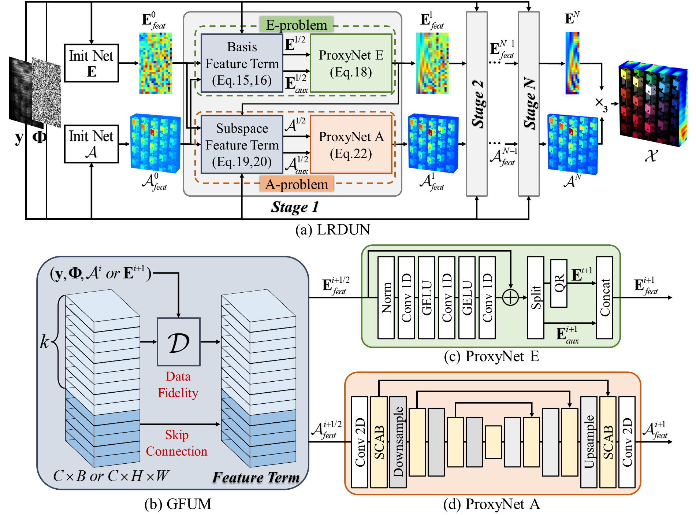
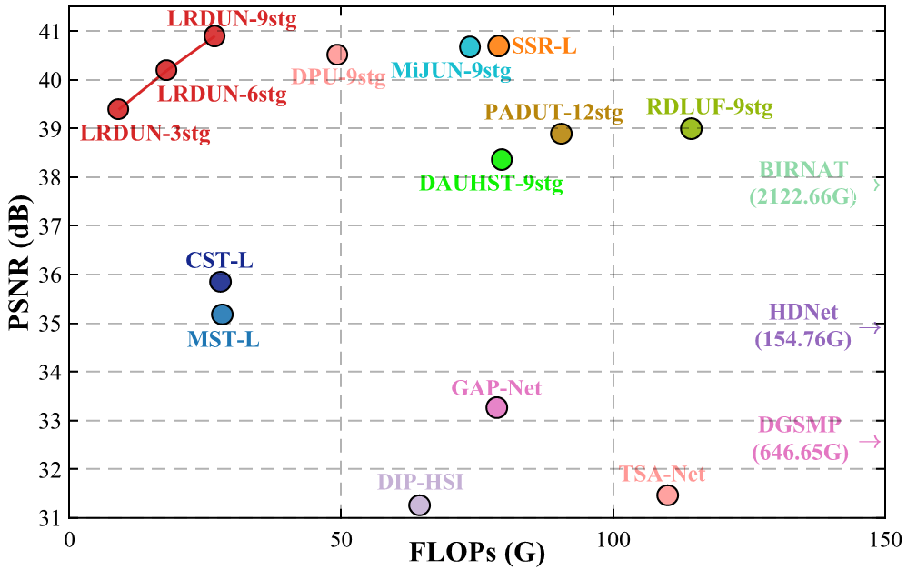
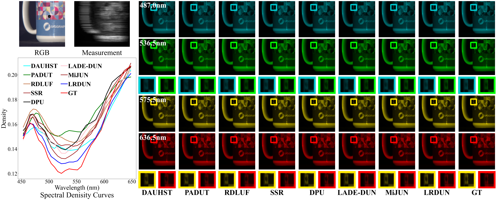
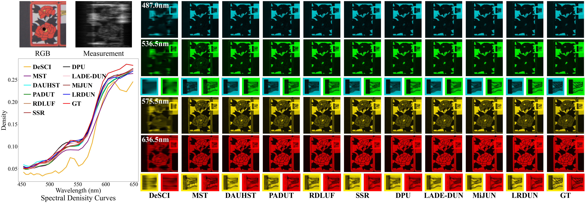
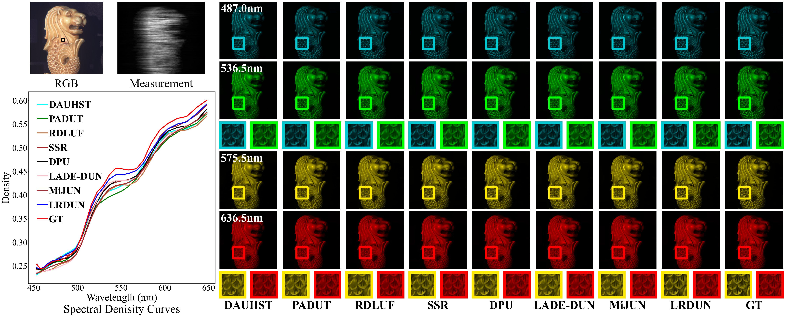
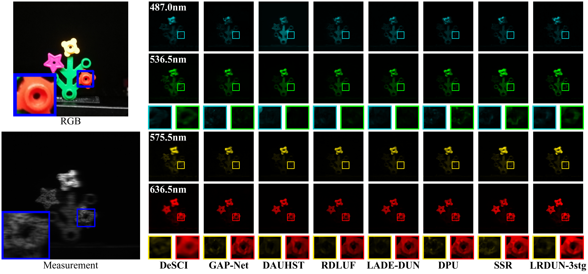
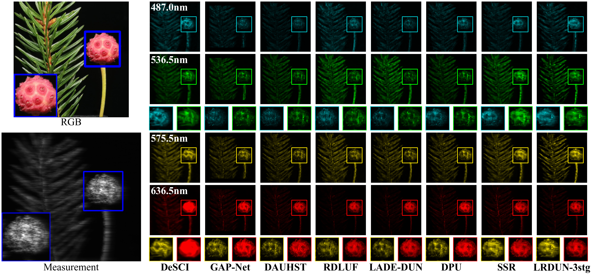
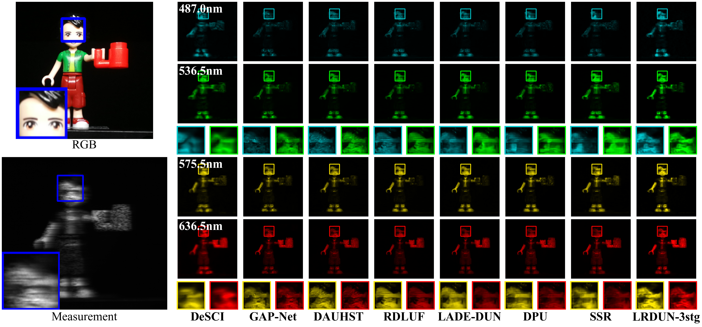

# LRDUN: A Low-Rank Deep Unfolding Network for Efficient Spectral Compressive Imaging (CVPR 2026)

This is the official PyTorch implementation of the CVPR 2026 paper [**"LRDUN: A Low-Rank Deep Unfolding Network for Efficient Spectral Compressive Imaging"**](https://arxiv.org/abs/2511.18513).

## 📖 Introduction

Deep unfolding networks (DUNs) have achieved remarkable
success and become the mainstream paradigm for
spectral compressive imaging (SCI) reconstruction. Existing
DUNs are derived from full-HSI imaging models, where
each stage operates directly on the high-dimensional HSI,
refining the entire data cube based on the single 2D coded
measurement. However, this paradigm leads to computational
redundancy and suffers from the ill-posed nature of
mapping 2D residuals back to 3D space of HSI. In this
paper, we propose two novel imaging models corresponding
to the spectral basis and subspace image by explicitly
integrating low-rank (LR) decomposition with the sensing
model. Compared to recovering the full HSI, estimating
these compact low-dimensional components significantly
mitigates the ill-posedness. Building upon these novel models,
we develop the Low-Rank Deep Unfolding Network
(LRDUN), which jointly solves the two subproblems within
an unfolded proximal gradient descent (PGD) framework.
Furthermore, we introduce a Generalized Feature Unfolding
Mechanism (GFUM) that decouples the physical rank in
the data-fidelity term from the feature dimensionality in the
prior module, enhancing the representational capacity and
flexibility of the network. Extensive experiments on simulated
and real datasets demonstrate that the proposed LRDUN
achieves state-of-the-art (SOTA) reconstruction quality
with significantly reduced computational cost.

**LRDUN** introduces a novel perspective:

* **Low-Rank Decomposition Modeling**: By explicitly integrating low-rank (LR) decomposition into the imaging model, the original HSI reconstruction problem is transformed into the estimation of two compact low-dimensional components: the **Spectral Basis** and the **Subspace Image**.
* **Decoupled Optimization**: We utilize an unfolded Proximal Gradient Descent (PGD) framework to jointly solve these two subproblems, significantly mitigating the ill-posed nature of the task.
* **Generalized Feature Unfolding Mechanism (GFUM)**: This mechanism decouples the physical rank in the data-fidelity term from the feature dimensionality, enhancing representational capacity while maintaining physical consistency.

<p align="center">

</p>

<p align="center">
<em>Overview of the LRDUN Architecture</em>
</p>


## 🛠️ Installation

Ensure you have PyTorch and the required dependencies installed.

```bash
git clone https://github.com/huang-he99/LRDUN.git
cd LRDUN
pip install -r requirements.txt
```

## 📂 Project Structure

```text
LRDUN_final/
├── simu.py                # Script for simulation experiments
├── real.py                # Script for real-world data experiments
├── checkpoint/            # Pre-trained models (.safetensors)
│   ├── real/              # Weights for real-world CASSI
│   │   └── lrdun_3stg.safetensors
│   └── simu/              # Weights for simulation (3, 6, 9 stages)
│       ├── lrdun_3stg.safetensors
│       ├── lrdun_6stg.safetensors
│       └── lrdun_9stg.safetensors
├── data/                  # Datasets and Masks
│   ├── mask/              # Mask files (.mat) for simu and real
|       |── real/
|           |── mask.mat     
|       |── simu
|           |── mask.mat     
│   ├── real/              # Real-world measurements (scene1-5)
│   └── simu/              # Simulation data (scene01-10)
├── model/                 # Network architecture components
│   ├── simu/              # Simulation-specific modules
│   │   ├── lrdun.py       # LRDUN model for simulation
│   │   └── physical_op.py # Physical degradation operators
│   └── real/              # Real-world-specific modules
│       ├── lrdun.py       
│       └── physical_op.py 
└── assert/                # Visualizations and illustrations
```

## 📥 Download
The pre-trained checkpoints and experimental results can be found at 
[Google Drive Link](https://drive.google.com/drive/folders/1QzhSuZgqrEUCEOv90oHeSVqus1xSok31?usp=drive_link).


## 🚀 Usage

### 1. Simulation Experiments

To run tests on simulated datasets:

```bash
python simu.py
```

### 2. Real-world Data Experiments

To reconstruct HSIs from real CASSI measurements:

```bash
python real.py
```

### 3. Training
Please refer to [MST](https://github.com/caiyuanhao1998/MST) or [DPU](https://github.com/ZhangJC-2k/DPU).

## 📊 Experimental Results

<p align="center">

</p>

<p align="center">
<em>PSNR and FLOPs</em>
</p>

### Simulation Benchmarks

LRDUN achieves state-of-the-art performance on multiple benchmark datasets while maintaining a significantly lower parameter count and computational overhead.

<p align="center">
   
</p>

<p align="center">
<em>Reconstruction results for Simulation Scene 5, 7, 10</em>
</p>

### Real-world Results

LRDUN demonstrates superior texture recovery and spectral fidelity on data captured by a real CASSI system.

<p align="center">
  
</p>

<p align="center">
<em>Reconstruction results on real-world scenarios</em>
</p>

## ✒️ Citation

If you find this work helpful for your research, please cite our paper:

```bibtex
@article{huang2025lrdun,
  title={LRDUN: A Low-Rank Deep Unfolding Network for Efficient Spectral Compressive Imaging},
  author={Huang, He and Guo, Yujun and He, Wei},
  journal={arXiv preprint arXiv:2511.18513},
  year={2025}
}
```